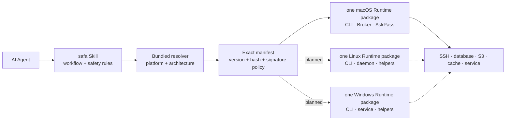

<p align="center">
  
</p>

# SAFA

**Secure Access for Agents.** Let an AI agent discover private infrastructure by logical alias and
run bounded operations without putting reusable credentials into prompts, logs, shell history, or a
repository.

[](https://github.com/juju-w/safa/actions/workflows/ci.yml)
[](https://github.com/juju-w/safa/stargazers)
[](LICENSE)


> [!IMPORTANT]
> SAFA is an unpublished diagnostic preview. The Swift/macOS runtime implements the bounded
> diagnostic path, but no signed runtime release, public installer, tag, or marketplace Skill has
> been published. Linux and Windows remain planned work.

## Stop pasting infrastructure secrets into chat

Imagine a service alert arrives:

> **You:** Find out why `report.prod` is alerting and whether the service is unhealthy.

Without a local access boundary, the conversation often becomes:

> **Agent:** What is the machine's IP and SSH port? Which username and password should I use? This
> check may need sudo—please send the sudo password too.

That puts infrastructure inventory and reusable credentials into chat history, process context,
logs, or model-visible tools.

With SAFA, private setup registers `report.prod` locally. The Agent sees the alias and safe
capabilities, then asks the native runtime to perform a bounded diagnostic:

```bash
safa exec report.prod --json \
  --intent "Check why the report service is alerting" -- \
  systemctl is-active report-api
```

The native runtime resolves the protected endpoint and credential, enforces policy, pins remote
identity, bounds/redacts output, and returns a stable JSON result. The Agent cannot retrieve the
stored password or private key. Integrity or identity failures stop the action instead of falling
back to raw SSH.

## One Skill and one native Runtime package per platform



Each platform produces one user-installable Runtime archive. CLI, Broker/daemon, and credential
helper remain separate processes inside that package because the Agent-facing CLI must not inherit
vault authority. The external CLI and JSON contract is shared; credential stores, local IPC, process
identity, user authorization, and service lifecycle remain native to each operating system.

Native implementations live in [`juju-w/safa-runtime`](https://github.com/juju-w/safa-runtime).

## Installation model

The intended public command is:

```bash
npx skills add juju-w/safa --skill safa -g -a codex
```

This command is not active release guidance yet. The repository is private during pre-release and
the runtime manifest intentionally contains no release entry.

The [`skills` CLI](https://github.com/vercel-labs/skills) discovers and copies or symlinks Skill
files; it does not run an npm-style `postinstall` hook. SAFA therefore uses a safe two-stage flow:

1. `npx skills add` installs `SKILL.md`, the small resolver, references, icons, and a locked manifest.
2. The first `safa doctor --json` invocation detects platform/architecture and checks for a verified
   native runtime.
3. If absent, the resolver may download only the exact manifest asset over HTTPS, verify SHA-256 and
   the platform signing identity, and install it under the current user's application-support scope.
4. The resolver invokes the native CLI; it never reads credentials or interprets remote commands.

This still gives the user a one-command Skill installation experience while avoiding arbitrary code
execution during Skill copying. An enterprise/offline installation may pre-provision the same
verified runtime; the resolver then reuses it after verification.

See [Runtime distribution and bootstrap](docs/distribution.md) for the exact trust and update model.

## What SAFA protects

- **Extensible private resource directory** — hosts, databases, object stores, caches, and services
  share typed aliases, metadata, relationships, and opaque credential references.
- **Two-level discovery** — list/show exposes only allowlisted safe metadata; protected inspection
  requires native user authorization and still never returns credentials.
- **Native credentials** — the current macOS runtime uses Data Protection Keychain and Secure
  Enclave primitives where supported; future platforms must use their own protected stores without
  a plaintext compatibility fallback.
- **Authenticated local boundary** — the runtime verifies local peer identity before credential use.
- **Strict remote identity** — SSH execution uses isolated configuration and a pinned host key.
- **One-shot delivery** — temporary password delivery is child-bound, short-lived, and single-use.
- **Bounded evidence** — execution limits time/output, preserves the remote exit code, and redacts
  matching credential bytes before returning data.
- **Least privilege** — different resource aliases can use different accounts and roles, reducing
  the blast radius of an Agent mistake or a compromised target.

## Current macOS diagnostic MVP

Implemented in `safa-runtime`:

- safe resource discovery by logical alias;
- user-authorized resource add/edit/setup/disable/enable/remove;
- SSH-config imports entering `draft/needs_setup` until host identity and authentication succeed;
- encrypted inventory and Keychain password storage;
- strict pinned-host SSH configuration;
- argument-constrained diagnostics such as `systemctl is-active`, fixed-field process/container
  metrics, `df`, `free`, and `uptime`;
- child-bound AskPass, output redaction, and sanitized audit events;
- signed per-user broker activation through `SMAppService` in a GUI-less app container;
- synthetic contract, integration, and security tests that contact no real server.

Not yet shipped:

- arbitrary remote mutation, sudo grants, and execution approval;
- complete credential enrollment/recovery and tamper-evident persistent audit history;
- verified runtime download/rollback and a public Skill package;
- Linux and Windows native runtimes.

## Repository map

```text
safa/
├── skills/safa/       # Agent instructions, resolver, references, icons
├── contracts/         # Canonical CLI/resource/distribution contracts
├── manifests/         # Reviewed exact-version runtime locks (empty during release hold)
├── docs/              # Product architecture, platform matrix, distribution model
└── tests/             # Skill and resolver contract validation

safa-runtime/
├── Sources, Apps, Tests       # Swift/macOS runtime
└── Platforms/Rust            # Linux/Windows runtime foundation
```

Contract changes start here and are consumed by runtime conformance tests. Runtime builds produce
signed assets; reviewed manifests flow back here before a Skill release can reference them.

## Distribution roadmap

1. **[skills.sh](https://www.skills.sh/)** — first public discovery target after verified macOS
   bootstrap and rollback pass an independent forward test.
2. **OpenAI, Claude Code, and GitHub Copilot ecosystems** — reuse the same Skill and locked runtime
   contract without platform-specific secret workflows.
3. **SkillHub and regional mirrors** — add only when provenance, signatures, and exact-version update
   behavior remain intact.

## Design and specification

The owl guardian represents a local, watchful security boundary. Source-ready assets include the
[transparent mascot](docs/assets/safa-mascot.webp), [square icon master](docs/assets/safa-icon-master.png),
and [GitHub avatar candidate](docs/assets/safa-github-avatar.png).

- [Product architecture](docs/architecture.md)
- [Runtime distribution and bootstrap](docs/distribution.md)
- [Platform support matrix](docs/platform-support.md)
- [CLI contract](contracts/cli-v1.md)
- [Resource directory contract](contracts/resource-directory-v1.md)
- [Native runtime implementation](https://github.com/juju-w/safa-runtime)

SAFA is licensed under the [MIT License](LICENSE).
