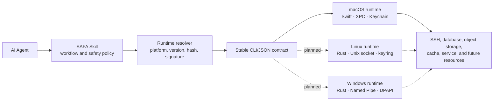

# SAFA

> Secure Access for Agents

SAFA gives AI agents a stable command-line interface for operating registered infrastructure without
putting reusable credentials into prompts, logs, shell history, or a repository. The Agent works with
logical aliases and bounded capabilities; a native runtime owns credentials, user authorization,
connection policy, and sanitization.

This repository is the platform-neutral product layer. Native implementations live in
[`safa-runtime`](https://github.com/juju-w/safa-runtime).

## Current status

SAFA is an unpublished preview. macOS is the first supported target and uses a Swift runtime backed
by Keychain and native user-presence authorization. Linux and Windows runtimes are architectural
targets, not currently supported products. Do not install SAFA from unverified forks or expect a
working public package yet.

No release, tag, notarized package, Homebrew formula, or Skill marketplace package has been
published. That hold is intentional while the external contract and distribution verifier settle.

## Architecture

The important boundary is not the implementation language. Every runtime must satisfy the same
versioned command and JSON contracts while using the operating system's own credential store,
process identity, IPC, signing, and authorization mechanisms.

## Repository contents

- `Skills/safa/` — the Agent-facing Skill. It currently describes only the truthful macOS preview.
- `contracts/` — versioned CLI, resource-directory, Skill/runtime, and distribution contracts.
- `manifests/` — reviewed, exact-version runtime manifests after verified releases exist.
- `docs/architecture.md` — product/runtime ownership and trust boundaries.
- `docs/platform-support.md` — supported and planned platform capabilities.

## Security model

- Agents see resource aliases and safe metadata, never raw stored credentials.
- Native runtimes own credential retrieval and operating-system authorization.
- Remote output is untrusted data and is bounded and sanitized before returning to the Agent.
- Runtime assets are selected by exact platform and architecture, then verified by digest and
  platform signing policy before activation.
- A successful Agent-side risk assessment is not user authorization.
- Vault data is not directly portable between operating systems. A future migration format requires
  an explicit, user-authorized, separately encrypted export/import flow.

See [the architecture document](docs/architecture.md) for the complete boundary model.

## Development

Contract changes should start in this repository and include compatibility fixtures before runtime
implementations adopt them. Runtime releases flow in the other direction: signed runtime assets are
produced first, an exact manifest is reviewed here, and only then may a Skill package reference
them.

The source code and documentation are licensed under the [MIT License](LICENSE). The license does
not make unverified binaries trustworthy; always verify release provenance and signatures.
