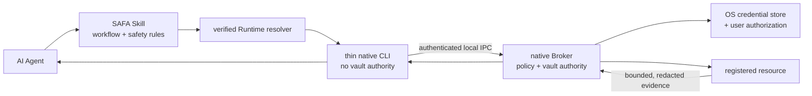

<p align="center">
  
</p>

# SAFA

**Secure Access for Agents.** SAFA lets an AI Agent discover private resources by logical alias and
request bounded operations without placing reusable credentials in prompts, process arguments,
logs, shell history, or a repository.

[](https://github.com/juju-w/safa/actions/workflows/ci.yml)
[](https://github.com/juju-w/safa/stargazers)
[](LICENSE)


> [!IMPORTANT]
> SAFA is an unpublished macOS diagnostic preview. No signed Runtime release, public installer,
> tag, or marketplace package is available yet. The installation command below describes the
> intended release experience, not current production guidance.

## What SAFA does

Infrastructure work often begins with an Agent asking for an IP address, SSH key, password, sudo
password, database credential, or private network route. SAFA keeps that setup in a native local
security boundary instead. The Agent works with an alias such as `report.prod`; the Runtime resolves
the protected connection and credential only after applying local policy.

```bash
safa exec report.prod --json \
  --intent "Check why the report service is alerting" -- \
  systemctl is-active report-api
```

The result is a bounded JSON envelope. Remote stdout and stderr remain explicitly untrusted, and the
Agent has no command that retrieves the stored password or private key.

## How it works



The Agent-facing CLI and the vault-authoritative Broker are separate processes. Open source code is
part of the threat model: security depends on native process identity, operating-system credential
storage, user authorization, strict target identity, policy, and bounded output—not hidden source.

Core guarantees of the current design:

- reusable credentials and vault keys never enter Agent-facing JSON;
- resources are selected by safe logical alias rather than copied endpoint details;
- SSH targets use pinned host identity and isolated client configuration;
- temporary password delivery is child-bound, short-lived, and single-use;
- output is bounded and matching credential bytes are redacted before return;
- verifier or authorization failures stop the operation instead of falling back to raw access.

See [Product architecture](docs/architecture.md) for the complete trust boundaries and limitations.

## Installation model

The intended public installation command is:

```bash
npx skills add juju-w/safa --skill safa -g -a codex
```

The Skill package contains instructions, a small platform resolver, references, icons, and an exact
Runtime manifest. On first use, the resolver selects the matching native Runtime, verifies its
digest and platform signature, installs it in the current-user scope, and invokes the CLI. The Skill
installer itself does not receive a secret or run an npm-style `postinstall` hook.

Runtime bootstrap is deliberately disabled during the publication hold. See
[Runtime distribution and bootstrap](docs/distribution.md) for the verification and rollback model.

## Command surface

The preview keeps the Agent workflow small:

```bash
safa doctor --json
safa resource list --json
safa resource show report.prod --json
safa topology show report.prod --json
safa topology path airflow.prod crawler.browser --json
safa exec report.prod --json --intent "Check service state" -- systemctl is-active report-api
```

Resource add/edit/remove and protected details require native macOS user authorization. Arbitrary
shell execution, sudo, mutation approval, and non-SSH protocol operations are not current Agent
capabilities. The canonical command and envelope definitions live in the
[CLI contract](contracts/cli-v1.md).

### Shell completion

The native CLI generates static completion for `zsh`, `bash`, and `fish`. For Oh My Zsh:

```bash
mkdir -p ~/.oh-my-zsh/completions
safa --generate-completion-script zsh > ~/.oh-my-zsh/completions/_safa
exec zsh
```

Only safe aliases are completed dynamically. Endpoints, usernames, inventory details, and
credentials are never completion candidates.

## Current scope

| Area | Status |
|---|---|
| macOS native Runtime | Swift preview implemented; signed public package not released |
| Resource directory | Host registration, encrypted inventory, safe summaries, authorized details |
| Topology | Placement, reachability, impact, and user-authorized logical relationship changes |
| Remote operation | Bounded non-sudo SSH diagnostics only |
| Linux and Windows native Runtimes | Planned; not yet selected or scaffolded |
| Database, object storage, cache, messaging, and HTTP adapters | Typed registration only; operations gated |
| Brokered browser sessions | Future security design only |

The [Platform support matrix](docs/platform-support.md) is authoritative for platform claims.

## Two repositories, one contract

| Repository | Owns |
|---|---|
| [`juju-w/safa`](https://github.com/juju-w/safa) | Agent Skill, public CLI/resource contracts, product documentation, conformance fixtures, and exact Runtime manifests |
| [`juju-w/safa-runtime`](https://github.com/juju-w/safa-runtime) | Native CLI/Broker/helper implementations, operating-system security adapters, tests, signing, and Runtime packaging |

The product repository defines public behavior. Native Runtimes implement that behavior and consume
the same conformance fixtures; they do not create a second Agent contract.

## Documentation

- [Product architecture](docs/architecture.md)
- [Topology model and Agent projections](docs/topology.md)
- [Runtime distribution and bootstrap](docs/distribution.md)
- [Platform support matrix](docs/platform-support.md)
- [Research references and influence map](docs/references.md)
- [Brokered browser access roadmap](docs/browser-access-roadmap.md)
- [Resource directory contract](contracts/resource-directory-v1.md)
- [Native Runtime repository](https://github.com/juju-w/safa-runtime)

SAFA is licensed under the [MIT License](LICENSE).
