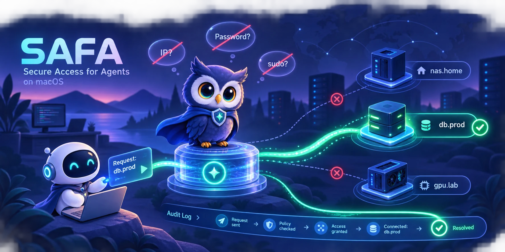
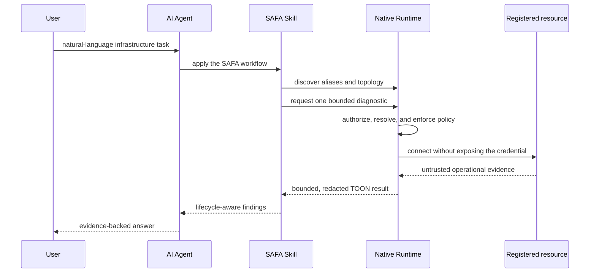

<p align="center">
  
</p>

# SAFA

**Secure Access for Agents.** SAFA is an Agent Skill backed by a native security Runtime. A user
describes an infrastructure problem in natural language; the Skill discovers the relevant private
resource, understands its relationships, selects a bounded diagnostic, and returns evidence without
asking the user to paste a reusable credential into the conversation.

[](https://github.com/juju-w/safa/actions/workflows/ci.yml)
[](https://github.com/juju-w/safa/stargazers)
[](LICENSE)


> [!IMPORTANT]
> SAFA is a macOS developer Source Preview. It builds the exact digest-pinned Runtime source on the
> user's own Mac and signs it with that user's local Apple Development identity. No Developer ID
> binary, notarized Runtime release, tag, or marketplace package is published yet. Do not interpret
> local source signing as public Apple publisher provenance.

## See it in action

After one-time local resource setup, the normal interface is the Agent conversation—not the CLI.
This illustrative target-v2 transcript uses fictional aliases and synthetic output.

> **You**
>
> Find out why the production website is unavailable. Diagnose it, but do not change anything.

> **Agent**
>
> I’ll use SAFA to find the registered service, check its known context, and run only bounded
> read-only diagnostics. You do not need to send me an IP address, SSH key, or password.

<details open>
<summary><strong>SAFA Skill activity</strong></summary>

| Step | Skill / Runtime call | Synthetic result |
|---:|---|---|
| 1 | `safa doctor` | Broker and vault are ready. |
| 2 | `safa resource list` | Safe alias `web.production` matches the request. |
| 3 | `safa topology show web.production` | The Broker returns the bounded service context. |
| 4 | `safa exec web.production … systemctl is-active nginx` | `active` |
| 5 | `safa exec web.production … df -h /` | Root filesystem is 98% full. |

</details>

> **Agent**
>
> Nginx is running, but the root filesystem is at 98% usage. Capacity pressure is the strongest
> current explanation for the outage. I did not restart the service or delete any files. The next
> step is to hand the finding to an operator for capacity remediation; that mutation is outside the
> current diagnostic preview.

See [more Agent conversations](docs/scenarios.md) for a topology question and a high-CPU diagnosis.

The Skill owns this workflow: discover aliases, use topology, choose a permitted action, interpret
lifecycle states, and treat remote output as untrusted evidence. If trusted local setup or user
authorization is required, it directs the user to the native flow instead of asking for the missing
password, key, token, endpoint, or sudo secret in chat.

SAFA deliberately separates those responsibilities:

| Layer | Responsibility |
|---|---|
| Agent Skill | Teaches compatible Agents how to discover resources, plan safe diagnostics, call SAFA, handle denials, and explain results. |
| Native Runtime | Resolves protected connection data, controls credentials, enforces policy and user authorization, connects to targets, and sanitizes evidence. |

The CLI is the narrow machine interface between these layers; it is not the primary product
experience and has no operation that returns a stored password or private key.

## Agent-native CLI design

SAFA's thin CLI is designed as an
[Agent eXperience Interface](https://axi.md/): it serves Agents only and does not maintain a second
human-oriented presentation mode. Except for a bare SemVer fast path, every result, empty state,
no-op, and error is one canonical [TOON](https://toonformat.dev/) document on stdout.

The surface follows four practical rules:

- default lists expose only three or four safe fields, with allowlisted `--fields` expansion;
- counts, health summaries, topology answers, truncation state, and useful next commands are
  precomputed when they avoid another Agent turn;
- no-argument roots return bounded live state instead of a manual, while `--help` remains concise
  and local to one command;
- errors use the same TOON contract, unknown input fails before any Broker or remote action, and
  terminal stdin is never used for a secret or approval.

The Runtime's XPC DTOs, encrypted storage, and native adapters remain private implementation
details. TOON is applied only at the Agent output boundary after policy, authorization, redaction,
and output limits. See the [CLI v2 contract](contracts/cli-v2.md).

## How it works



The Agent-facing CLI and the vault-authoritative Broker are separate processes. Open source code is
part of the threat model: security depends on native process identity, operating-system credential
storage, user authorization, strict target identity, policy, and bounded output—not hidden source.

Core guarantees of the current design:

- reusable credentials and vault keys never enter Agent-facing output;
- resources are selected by safe logical alias rather than copied endpoint details;
- SSH targets use pinned host identity and isolated client configuration;
- a separately signed no-custom-GUI setup helper can enroll a new password SSH host while every
  protected field remains hidden from Agent argv, environment, stdin, stdout, and stderr;
- temporary password delivery is child-bound, short-lived, and single-use;
- output is bounded and matching credential bytes are redacted before return;
- verifier or authorization failures stop the operation instead of falling back to raw access.

See [Product architecture](docs/architecture.md) for the complete trust boundaries and limitations.

## Installation model

Install the Source Preview Skill with:

```bash
npx skills add juju-w/safa --skill safa -g -a codex
```

The Skill package contains instructions, a small launcher, references, icons, an exact Runtime source
manifest, and a human-only build wrapper. The Skill installer does not receive a secret, compile
native code, or run an npm-style `postinstall` hook.

First `doctor` returns one explicit local action marked `safe_for_agent: false`:

```bash
./scripts/install-source-preview.sh --confirm-local-build
```

Run it yourself in a normal terminal. It verifies the exact source archive digest and layout, invokes
Xcode locally, verifies the signed Runtime components, and installs atomically in the current-user
scope. It requires macOS 14.4+, Xcode 16.3+, and one Apple Development identity, but no paid Apple
Developer Program, Homebrew, `sudo`, `xattr` bypass, or downloaded precompiled executable. See
[Runtime distribution and bootstrap](docs/distribution.md).

## What the Skill invokes

The commands below make the Agent-to-Runtime contract inspectable. Users normally express these
tasks in natural language, while the Skill selects from this small surface using safe aliases.

<details>
<summary>Show representative Runtime calls</summary>

```bash
# Confirm that SAFA is ready and discover safe aliases.
safa doctor
safa resource list

# Inspect the safe summary for a storage host, then check its root filesystem.
safa resource show storage.primary
safa exec storage.primary --intent "Check a disk capacity alert" -- df -h /

# Find the processes consuming the most CPU on a batch worker.
safa exec worker.batch --intent "Investigate a high CPU alert" -- \
  ps -eo pid,ppid,user,stat,comm,%cpu,%mem --sort=-%cpu

# Ask the Broker whether an application has a verified path to its database.
safa topology path app.production database.primary
```

</details>

Protected resource changes and details require native macOS user authorization. Similar resource
setup or desired topology-link actions can reuse separate Broker-memory authorization for up to five
minutes; destructive/state changes still require a fresh prompt. Arbitrary
shell execution, sudo, mutation approval, and non-SSH protocol operations are not current Agent
capabilities. The canonical command and envelope definitions live in the
[CLI contract](contracts/cli-v2.md).

## Current scope

| Area | Status |
|---|---|
| macOS native Runtime | Swift Source Preview implemented; locally built/signed, no public binary |
| Resource directory | Existing OpenSSH import plus hidden password host registration, encrypted inventory, safe summaries, authorized details |
| Topology | Placement, reachability, impact, and user-authorized logical relationship changes |
| Remote operation | Bounded non-sudo SSH diagnostics only |
| Linux and Windows native Runtimes | Planned; not yet selected or scaffolded |
| Database, object storage, cache, messaging, and HTTP adapters | Typed registration only; operations gated |
| Brokered browser sessions | Future security design only |

The [Platform support matrix](docs/platform-support.md) is authoritative for platform claims.

## Two repositories, one contract

| Repository | Owns |
|---|---|
| [`juju-w/safa`](https://github.com/juju-w/safa) | Agent Skill, public Agent-CLI/TOON/resource contracts, product documentation, conformance fixtures, and exact Runtime manifests |
| [`juju-w/safa-runtime`](https://github.com/juju-w/safa-runtime) | Native CLI/Broker/helper implementations, operating-system security adapters, tests, signing, and Runtime packaging |

The product repository defines public behavior. Native Runtimes implement that behavior and consume
the same conformance fixtures; they do not create a second Agent contract.

## Documentation

- [Product architecture](docs/architecture.md)
- [Agent conversation examples](docs/scenarios.md)
- [Topology model and Agent projections](docs/topology.md)
- [Runtime distribution and bootstrap](docs/distribution.md)
- [Platform support matrix](docs/platform-support.md)
- [Research references and influence map](docs/references.md)
- [Agent CLI v2 benchmark results](docs/agent-cli-v2-benchmark.md)
- [Brokered browser access roadmap](docs/browser-access-roadmap.md)
- [Resource directory contract](contracts/resource-directory-v1.md)
- [Agent CLI v2 contract](contracts/cli-v2.md)
- [Native Runtime repository](https://github.com/juju-w/safa-runtime)

SAFA is licensed under the [MIT License](LICENSE).
