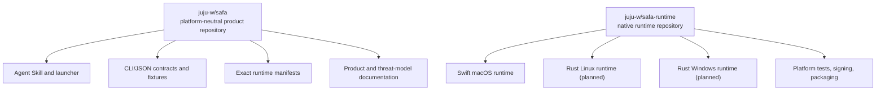
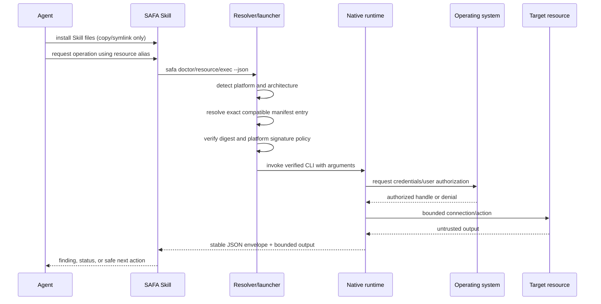
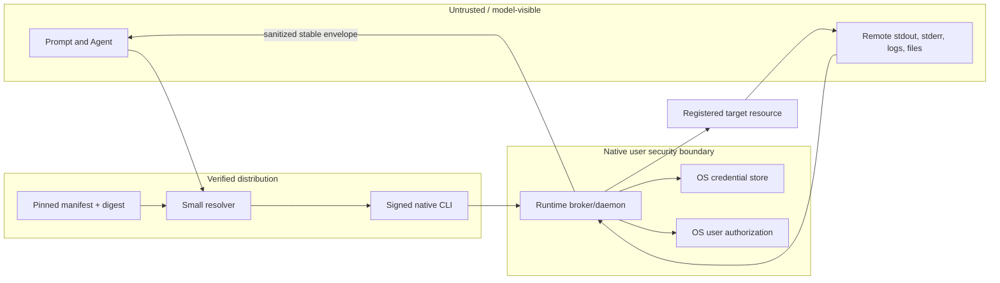

# SAFA Product Architecture

## 1. Purpose

SAFA is a local security boundary between an AI Agent and private infrastructure. It lets an Agent
discover resources by alias and request bounded operations while keeping credentials, authorization,
connection policy, and reusable grants out of the model-visible channel.

Cross-platform support does not mean sharing one vault implementation. It means providing one
external contract and independent native runtimes that use each operating system's security model.

## 2. Repository ownership

`safa` is the canonical source for public behavior. `safa-runtime` implements that behavior and may
mirror a pinned contract revision for CI, but it does not independently redefine the contract.

## 3. Runtime selection and execution

The Skill installer does not execute an npm-style lifecycle hook. The launcher is installed as an
ordinary Skill file and is deliberately narrow. On first invocation it selects, verifies, installs
one native Runtime package in the current user's scope, and invokes its CLI. It cannot read vault
data, interpret remote commands, approve work, or weaken the Broker's authorization decision.

## 4. Stable external contract

All platforms expose the same conceptual surface:

- `doctor` for compatibility and runtime readiness;
- resource-directory lifecycle using aliases and typed safe metadata;
- bounded execution/request state with stable status and error codes;
- version negotiation before protected actions;
- a JSON envelope that separates trusted control fields from untrusted remote output.

The internal implementation may differ. macOS can use XPC, Linux can use a Unix domain socket with
peer-credential checks, and Windows can use a Named Pipe with access control. Those transports are
not part of the Agent-facing contract.

## 5. Platform runtime design

| Platform | Implementation | Credential authority | Local IPC / identity | Status |
| --- | --- | --- | --- | --- |
| macOS | Swift | Keychain with access control and user presence | XPC, code identity, SMAppService | Preview implementation |
| Linux | Rust | Secret Service/kernel keyring adapter; no plaintext fallback | Unix socket, `SO_PEERCRED`, systemd user service | Planned/scaffold only |
| Windows | Rust | DPAPI/Credential Manager adapter | Named Pipe ACL, process/user identity | Planned |

Platform adapters implement a small set of capabilities: secure storage, user authorization,
trusted local IPC, process identity, host-key/endpoint policy, and lifecycle management. Protocol,
resource domain, sanitization, and conformance behavior remain platform-neutral.

“One Runtime” refers to one installed package, not one all-powerful process. The package keeps a thin
Agent-facing CLI separate from the Broker/daemon that owns vault authority. On macOS the package is
`SAFA.app`, containing `safa`, `safa-broker`, and the one-shot `safa-askpass` helper.

## 6. Trust boundaries

Key invariants:

1. The Agent never receives a reusable credential or vault decryption key.
2. The runtime never treats Agent prose or remote output as proof of user authorization.
3. Resource aliases are safe identifiers; protected routing and inventory remain native-runtime data.
4. Remote output is bounded and remains explicitly untrusted.
5. A verifier failure is terminal. The launcher does not fall back to an unsigned binary or raw SSH.
6. A compromised remote server must not obtain credentials for unrelated registered resources.

## 7. Resource extensibility

The directory models a resource as a typed profile with a stable alias, lifecycle state, safe public
metadata, protected connection material, and declared capabilities. SSH hosts are the first profile;
database, object storage, cache, and service profiles can reuse the same directory without forcing
their credentials into SSH-shaped fields.

Adding a type requires a contract definition and platform-independent conformance fixtures before a
runtime adapter is considered supported.

## 8. Distribution and releases

Runtime and Skill releases are separate:

1. `safa-runtime` builds platform assets in isolated CI.
2. Platform signing/notarization is verified and checksums are generated.
3. A pull request adds an exact-version manifest to `safa`.
4. Contract compatibility and provenance are reviewed.
5. Only then may a Skill release reference that manifest.

The resulting user journey is one Skill installation command followed by normal use. Runtime
bootstrap happens on the first launcher invocation, not as hidden code execution inside
`npx skills add`. See [distribution.md](distribution.md).

There is no automatic `latest` promotion. Rollback selects a previously reviewed manifest; it does
not mutate an already published manifest.

The current publication hold prohibits tags, Releases, marketplace uploads, public installers, and
embedded runtime archives.

## 9. Data portability

Native vaults are intentionally not copied directly across systems. A future migration workflow may
export a versioned envelope encrypted to a new recovery/import key after explicit local user
authorization. Import must rebind each secret to the destination OS credential store and must not
leave a plaintext intermediate. This workflow is not part of the current preview.

## 10. Migration sequence

1. Freeze and version the current CLI/JSON/resource contracts in `safa`.
2. Keep the working Swift implementation intact while moving product-owned Skill material here.
3. Add the Rust workspace and Linux platform boundary without claiming Linux support.
4. Introduce shared conformance fixtures consumed by both Swift and Rust CI.
5. Implement and security-review a Linux credential/IPC adapter.
6. Produce signed macOS runtime assets and a verified manifest.
7. Release the Skill only after the end-to-end resolver and rollback path pass review.
