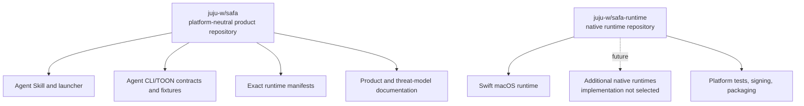
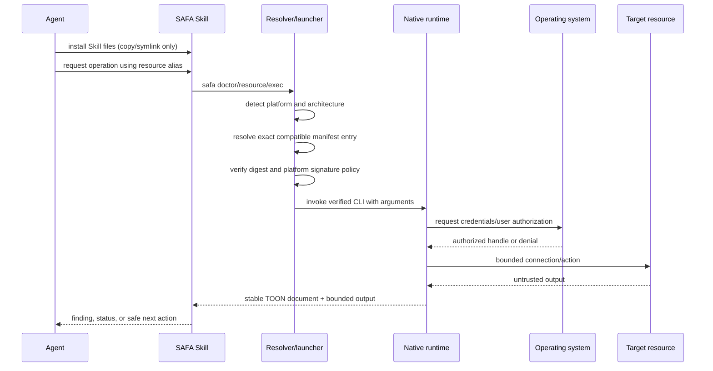
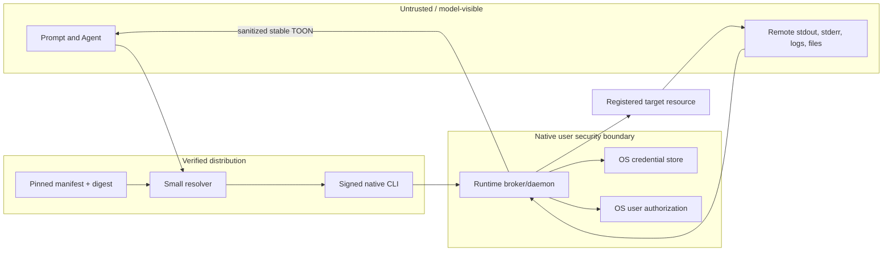

# SAFA Product Architecture

## 1. Purpose

SAFA is a local security boundary between an AI Agent and private infrastructure. It lets an Agent
discover resources by alias and request bounded operations while keeping credentials, authorization,
connection policy, and reusable grants out of the model-visible channel.

Cross-platform support does not mean sharing one vault implementation. It means providing one
external contract and independent native runtimes that use each operating system's security model.

## 2. Repository ownership

`safa` is the canonical source for public behavior. `safa-runtime` implements that behavior and may
mirror a pinned contract revision for CI, but it does not independently redefine the contract.

## 3. Runtime selection and execution

The Skill installer does not execute an npm-style lifecycle hook. The launcher is installed as an
ordinary Skill file and is deliberately narrow. On first invocation it selects, verifies, installs
one native Runtime package in the current user's scope, and invokes its CLI. It cannot read vault
data, interpret remote commands, approve work, or weaken the Broker's authorization decision.

The launcher is a script, not a portable native binary. The current POSIX shell entry serves the
macOS Runtime. Another platform entry is added only with that platform's reviewed Runtime. Platform
detection belongs here; credential access and protected operations remain in the selected native
Runtime.

## 4. Stable external contract

All platforms expose the same conceptual surface:

- `doctor` for compatibility and runtime readiness;
- resource-directory lifecycle using aliases and typed safe metadata;
- bounded execution/request state with stable status and error codes;
- version negotiation before protected actions;
- one canonical TOON document that separates trusted control fields from untrusted remote output.

The internal implementation may differ. macOS can use XPC, Linux can use a Unix domain socket with
peer-credential checks, and Windows can use a Named Pipe with access control. Those transports are
not part of the Agent-facing contract.

The first public contract targets `dev.safa.cli/v2`. It is an Agent-only
[AXI](https://axi.md/) surface: no human renderer, no `--json`/`--toon` format negotiation, and no
interactive terminal input. TOON is produced only at the final presentation boundary from explicit
typed DTOs. Broker IPC, vault persistence, and adapter protocols remain private and format-neutral.

Lists default to three or four safe fields; additional fields require a command-specific allowlisted
`--fields`. Long content is previewed with total size and explicit truncation, and `--full` remains
subject to a Broker hard cap. Results carry cheap aggregates and deterministic answers when they
prevent a predictable second call. Empty success, no-op, and error states are explicit. Unknown
input fails before Broker work, while stdout remains one TOON document and stderr carries only
redacted diagnostics.

No-argument roots expose a bounded safe home view and contextual command templates. An optional
session integration may inject that same safe view only after explicit setup; it never captures
transcripts, protected topology, or remote output for ambient reuse. The complete target is
specified in [`cli-v2.md`](../contracts/cli-v2.md). JSON v1 is not retained as a second public mode.

## 5. Platform runtime design

| Platform | Implementation | Credential authority | Local IPC / identity | Status |
| --- | --- | --- | --- | --- |
| macOS | Swift | Keychain with access control and user presence | XPC, code identity, SMAppService | Preview implementation |
| Linux | Not selected | Secret Service/keyring adapter required; no plaintext fallback | Unix socket + native authorization design required | Planned only |
| Windows | Not selected | DPAPI/Credential Manager required | Named Pipe + ACL design required | Planned only |

Platform adapters implement a small set of capabilities: secure storage, user authorization,
trusted local IPC, process identity, host-key/endpoint policy, and lifecycle management. Protocol,
resource domain, sanitization, and conformance behavior remain platform-neutral.

“One Runtime” refers to one installed package, not one all-powerful process. The package keeps a thin
Agent-facing CLI separate from the Broker/daemon that owns vault authority. On macOS the package is
`SAFA.app`, containing `safa`, `safa-broker`, and the one-shot `safa-askpass` helper.

## 6. Trust boundaries

Key invariants:

1. The Agent never receives a reusable credential or vault decryption key.
2. The runtime never treats Agent prose or remote output as proof of user authorization.
3. Resource aliases are safe identifiers; protected routing and inventory remain native-runtime data.
4. Remote output is bounded and remains explicitly untrusted.
5. A verifier failure is terminal. The launcher does not fall back to an unsigned binary or raw SSH.
6. A compromised remote server must not obtain credentials for unrelated registered resources.

## 7. Resource extensibility

The directory classifies a resource with independent kind, immutable template ID/version, optional
host platform, and orthogonal roles. A NAS is therefore a host role rather than an operating-system
type. Each resource also has a stable alias, lifecycle state, safe public metadata, protected
connection material, and declared capabilities. SSH hosts are the first executable profile;
database, object storage, cache, messaging, search, graph, and service profiles can reuse the same
directory without forcing their credentials into SSH-shaped fields.

Initial SSH activation runs one bounded read-only probe after account and platform verification.
Validated CPU, memory, storage, architecture, hardware, OS/kernel, and Docker facts are committed in
the same encrypted-vault transaction as activation and are disclosed only through the protected
details path unless an individual key is source-code allowlisted.

Adding a type requires a contract definition and platform-independent conformance fixtures before a
runtime adapter is considered supported.

### 7.1 Topology is data, not a drawing

SAFA does not use Mermaid, an arrow diagram, a tree, or a screenshot as the topology source of
truth. Infrastructure is not a tree: a service can run on one host, depend on a database on another,
replicate to storage in a third site, and be reachable through several routes at once.

The encrypted authority is a directed, typed, attributed multigraph. It separates desired claims,
Broker-observed facts, and deterministic derived paths. The Agent receives only a reviewed logical
projection with aliases; endpoints, CIDRs, ports, usernames, route coordinates, evidence records,
and credential bindings remain protected.

The Runtime chooses a bounded projection for each task:

| Question | Agent input |
|---|---|
| What exists or where is it placed? | node table plus typed edge list |
| Can A reach B and through what? | adjacency list plus a Broker-computed proof path |
| What breaks if B fails? | reverse adjacency list plus a computed affected set |
| Compare one relation across a small dense set | bounded relation matrix with a stable legend |
| Show a person the architecture | diagram derived from the same projection |

Storage order is normalized, while task projections use stable, declared ordering. Large graphs are
reduced to a connected question-relevant subgraph; the model is not asked to reconstruct the whole
graph from a token dump. Exact connectivity, path, and cycle computations belong to the Broker.
The LLM plans, explains, and proposes desired relationship changes, but cannot self-verify an edge
or turn a diagram interpretation into route or credential authority.

The normative graph, trust, projection, and disclosure rules are in
[`topology-projection-v1.md`](../contracts/topology-projection-v1.md). Visual output remains a human
or auxiliary multimodal view and is never the sole machine input for an operational decision. See
the [topology algorithm and Agent decision diagrams](topology.md) for a worked visual explanation.

## 8. Distribution and releases

Runtime and Skill releases are separate:

1. `safa-runtime` builds platform assets in isolated CI.
2. Platform signing/notarization is verified and checksums are generated.
3. A pull request adds an exact-version manifest to `safa`.
4. Contract compatibility and provenance are reviewed.
5. Only then may a Skill release reference that manifest.

The resulting user journey is one Skill installation command followed by normal use. Runtime
bootstrap happens on the first launcher invocation, not as hidden code execution inside
`npx skills add`. See [distribution.md](distribution.md).

There is no automatic `latest` promotion. Rollback selects a previously reviewed manifest; it does
not mutate an already published manifest.

The current publication hold prohibits tags, Releases, marketplace uploads, public installers, and
embedded runtime archives.

## 9. Data portability

Native vaults are intentionally not copied directly across systems. A future migration workflow may
export a versioned envelope encrypted to a new recovery/import key after explicit local user
authorization. Import must rebind each secret to the destination OS credential store and must not
leave a plaintext intermediate. This workflow is not part of the current preview.

## 10. Migration sequence

1. Keep the Agent-only TOON v2 contract and pinned official conformance sources synchronized.
2. Keep the Skill and exact Runtime schema range atomic; do not publish a dual-format mode.
3. Preserve the native security boundary while evolving only explicit presentation DTOs.
4. Re-run the SAFA task corpus when the CLI contract or selected Agent models change; record
   completion, turns, tokens, and latency rather than inferring results from third-party benchmarks.
5. Keep the universal Skill entry as a small script resolver; do not introduce a shared native
   launcher binary.
6. Introduce shared conformance fixtures consumed by each implemented platform Runtime CI.
7. Produce signed macOS Runtime assets and a verified manifest.
8. Release the Skill only after the end-to-end resolver and rollback path pass review.
9. Choose and implement another platform Runtime only when that work is actually scheduled.

## 11. Future browser-session capability

Website authentication can reuse the encrypted resource directory and native Broker, but it must
not be implemented as a command that returns a password, cookie, TOTP code, or unrestricted browser
endpoint. A future `service.http` capability may create an origin-bound, expiring browser context in
which a trusted bridge performs authentication and the Agent receives only constrained session
authority.

Because raw Playwright/CDP control can read form values and export authenticated storage, this is a
new security adapter with its own hostile-page and compromised-Agent threat model—not a thin
autofill wrapper. It remains outside the current preview. The proposed trust flow, staged delivery,
and ship criteria are documented in [Brokered browser access roadmap](browser-access-roadmap.md).
