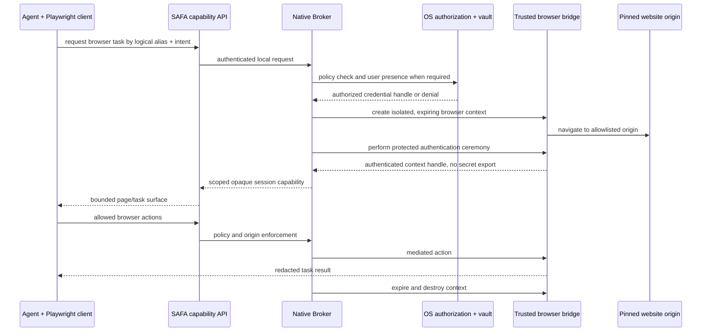

# Brokered Browser Access Roadmap

> Status: future product direction only. It is not part of the current macOS diagnostic MVP and
> defines no released command, browser extension, Playwright adapter, or credential-import format.

## 1. Product direction

Many Agent tasks eventually reach a website that requires an account. Asking the user to paste a
password, one-time code, session cookie, or recovery secret into the conversation would recreate the
same problem SAFA is intended to remove from infrastructure access.

SAFA can extend the existing `service.http` resource model with a future **browser-session
capability**. The Agent would select a logical alias and request a scoped browser task. The Broker
would resolve the protected site/account binding, authorize the request, and mediate login inside an
isolated browser context. The Agent would receive a capability for that context, never a credential
value.

This is closer to delegated browser access than to a password-retrieval API:

- the Agent asks to use an account for one declared purpose;
- the Broker binds that grant to an exact web origin, a short lifetime, and an isolated session;
- a trusted browser bridge performs the sensitive authentication ceremony;
- the Agent may operate only through the granted session surface;
- passwords, passkey private keys, TOTP seeds, cookies, and browser storage are not exportable Agent
  outputs.

## 2. Why ordinary Playwright autofill is insufficient

Raw Playwright and Chrome DevTools Protocol access are highly privileged. A controller can evaluate
page JavaScript, read input values, inspect network traffic, export storage state, retrieve cookies,
record traces, and take screenshots. Passing a secret to an Agent-owned Playwright process—or typing
it into a page while that process retains unrestricted control—does not provide a meaningful secret
boundary.

The sensitive login phase must therefore be Broker-owned. A future bridge must deny or mediate
capabilities such as arbitrary runtime evaluation, credential-field reads, cookie/storage export,
cross-origin navigation, trace/video capture, and unreviewed network egress. Exposing an unrestricted
CDP endpoint would violate the design even if the password itself never appeared in the CLI JSON.

Legacy password login also has an unavoidable limit: the authorized destination page and browser
must receive the password in order to submit it. SAFA can keep that password away from the Agent,
prompt, command line, logs, and traces; it cannot make a password safe from a compromised destination
site or compromised browser process. Origin-bound passkeys avoid much of this weakness and should
be preferred.

## 3. Proposed trust flow

The capability is authority, not merely an identifier. It must be bound to the requesting local
client, resource alias, origin set, action class, expiration, and revocation state. Possessing a
session identifier alone must not allow a second process to attach to the browser.

## 4. Authentication preference

Future adapters should prefer, in order:

1. **Passkeys/WebAuthn** — the private key remains in Keychain/Secure Enclave and authentication is
   origin-bound. User verification can be requested by the operating system.
2. **OAuth/OIDC device or delegated authorization** — use a purpose-scoped token or user-approved
   grant instead of disclosing an account password.
3. **Password plus TOTP** — a legacy compatibility path. The password and TOTP seed stay Broker-only;
   any generated one-time code is short-lived and injected only during the protected login phase.
4. **Existing session material** — cookies and browser storage are bearer credentials and receive the
   same protection as passwords. They must be isolated, time-bounded, revocable, and non-exportable.

Recovery codes and passkey private keys must never be exposed through Agent-facing commands.

## 5. Resource and policy model

This direction does not need a second inventory system. A website remains a `service.http` resource;
browser access is an optional versioned capability and credential binding. Safe discovery may expose
only its logical alias, display purpose, and available high-level capability. Protected fields can
include the exact login origin, approved redirect origins, account label, authentication method,
and policy profile. Secret material remains in the native credential store rather than resource
metadata.

A grant should minimally constrain:

- exact HTTPS origins and reviewed authentication redirects;
- session lifetime and idle timeout;
- read-only, form-submit, upload, download, or transaction action classes;
- whether user presence is required at session creation or at a high-risk action;
- capture policy for screenshots, traces, downloads, and returned page content;
- network egress and whether cross-origin navigation fails closed;
- an immutable intent and sanitized action-level audit record.

Logging the Agent's free-form explanation alone is not authorization. Likewise, an Agent-written
audit message does not prove what the browser did.

## 6. Delivery stages

This work should begin only after the current resource, topology, broker, signing, and distribution
path is stable.

### B0 — threat model and synthetic test site

- specify the browser capability and attacker model without adding a production command;
- build local synthetic sites for phishing redirects, hostile JavaScript, cookie export, trace
  capture, cross-origin navigation, and session theft tests;
- decide whether the bridge is a browser extension, a Broker-owned browser, or a filtered automation
  transport only after the security tests exist.

### B1 — origin-bound authentication

- support a Broker-owned ephemeral browser context;
- prefer passkey/WebAuthn or delegated OAuth flows;
- return an opaque, caller-bound session capability rather than a password, cookie, or CDP endpoint;
- destroy the context on expiry, denial, local client exit, or revocation.

### B2 — legacy login compatibility

- add bounded password/TOTP form handling with explicit origin pinning and user presence policy;
- suppress sensitive fields from screenshots, traces, logs, accessibility snapshots, and Agent
  results;
- fail closed on ambiguous forms, certificate errors, unexpected redirects, CAPTCHA, or account
  recovery flows.

### B3 — constrained browser automation

- expose a small task-oriented automation surface rather than unrestricted Playwright/CDP;
- separate login authority from post-login action authority;
- add per-site policies for consequential actions such as publishing, purchasing, deleting, or
  changing account security settings.

## 7. Security exit criteria

The feature must not ship until tests demonstrate that:

- no reusable password, TOTP seed, passkey private key, cookie, or storage state reaches Agent-visible
  arguments, environment, stdin, JSON, logs, screenshots, videos, or traces;
- an Agent cannot attach through raw CDP, export the authenticated context, or reuse its capability
  from another local process;
- an origin or redirect mismatch, TLS failure, unexpected login form, or authorization denial fails
  closed;
- session expiry and revocation destroy browser state and terminate further actions;
- the user can see which logical account, website, purpose, and action class are being authorized;
- hostile-page and compromised-Agent fixtures are part of continuous security testing.

Until these conditions are met, Agents should continue to use their own unprivileged browser
sessions and ask the user to complete sensitive interactive login directly in the browser—not paste
credentials into chat.
