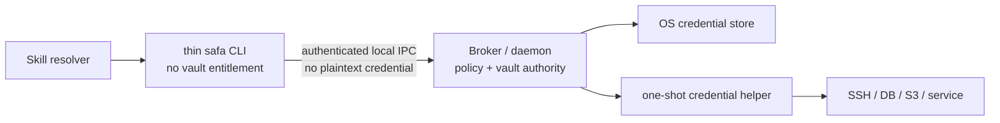
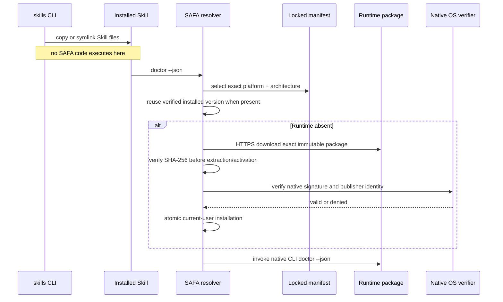

# Runtime Distribution and Bootstrap

## 1. User experience

The target installation command is:

```bash
npx skills add juju-w/safa --skill safa -g -a codex
```

The `npx` process runs the external `skills` CLI. SAFA itself is not an npm package and does not use
an npm `postinstall` script. The Skill installer copies or symlinks the `skills/safa` directory into
the selected Agent's Skill directory.

The installed Skill includes a small resolver. The first Agent workflow calls:

```bash
./scripts/safa doctor --json
```

That invocation performs Runtime discovery/bootstrap before any protected operation.

## 2. One Runtime package, several trust roles

Users install one Runtime package for their platform. The package retains internal process
separation:



Local IPC authentication and Broker-side policy matter more than adding application-layer encryption
to a channel that never carries plaintext credentials. A modified frontend must not gain additional
authority: the Broker authenticates the peer where the platform allows it, ignores client-supplied
identity claims, resolves protected data itself, and never exposes a raw-secret method.

Open source is compatible with this design. Runtime signing keys, vault keys, and user credentials
are not source code. Security must survive complete knowledge of the implementation.

## 3. Why bootstrap is not an install hook

Executing arbitrary repository scripts while merely installing Agent instructions would enlarge the
supply-chain blast radius and behave inconsistently across Agent platforms. A copy-only Skill install
has a reviewable result. Runtime activation remains an explicit SAFA operation with a stable JSON
error or user action when it cannot proceed safely.

## 4. Resolver inputs

The resolver trusts only data shipped with the exact Skill revision:

- the supported CLI schema range;
- exact Runtime version per platform and architecture;
- immutable HTTPS asset URL;
- SHA-256 digest;
- archive format and expected entry point;
- native signing/notarization/publisher policy.

The resolver does not use a mutable `latest` URL, a GitHub “newest release” response, a remote shell
script, an environment-supplied credential, or an Agent-provided alternate download location.

## 5. Bootstrap sequence



Temporary downloads use a newly created private directory. Activation is an atomic rename into an
exact-version directory under the current user's application-support/data scope. The resolver keeps
the previous verified version for rollback and never requires sudo.

## 6. Platform locations

| Platform | Runtime data scope | Native verification |
| --- | --- | --- |
| macOS | `~/Library/Application Support/SAFA/runtimes/<version>/` | SHA-256, `codesign`, Team/identifier, notarization/Gatekeeper |
| Linux | `${XDG_DATA_HOME:-~/.local/share}/safa/runtimes/<version>/` | SHA-256 plus reviewed minisign/Sigstore policy |
| Windows | `%LOCALAPPDATA%\\SAFA\\runtimes\\<version>\\` | SHA-256 plus Authenticode publisher policy |

Only macOS is currently implemented. The table defines future boundaries, not current support.

Linux needs an explicit limitation: Unix-socket ownership and `SO_PEERCRED` can identify a user but
cannot distinguish an official CLI from malicious code already running as that same user. High-risk
credential use therefore requires a separate native user-authorization mechanism such as a reviewed
Polkit/PAM/FIDO flow; peer UID alone is insufficient.

## 7. Update and rollback

- `skills update` may install a newer Skill revision and therefore a newer locked manifest.
- The resolver never changes the manifest independently of the installed Skill revision.
- A new Runtime is downloaded beside the active version, verified, then atomically selected.
- Verification or health-check failure leaves the previous version active.
- Rollback selects a previously verified exact version; it never mutates a published manifest.
- Runtime cleanup retains the active and previous verified versions until a reviewed retention policy
  is implemented.

## 8. Offline and managed environments

An administrator may pre-provision the exact Runtime package into the same current-user runtime
store. The resolver still verifies digest and native signing identity before use. A regional mirror
requires a separately reviewed manifest entry with its own immutable URL; DNS or proxy redirection
is not a substitute for provenance verification.

## 9. Current release hold

No Runtime package or exact manifest is published yet. The current launcher therefore returns
`runtime_missing`/`user_action_required` instead of downloading an unverified development artifact.
