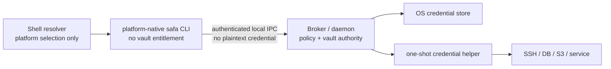
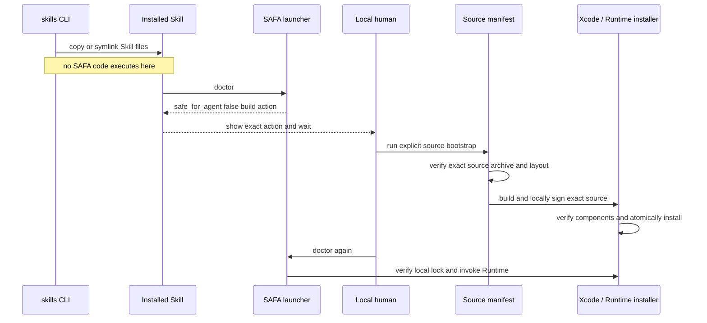

# Source Preview and Runtime Distribution

## 1. Source Preview user experience

The target installation command is:

```bash
npx skills add juju-w/safa --skill safa -g -a codex
```

The `npx` process runs the external `skills` CLI. SAFA itself is not an npm package and does not use
an npm `postinstall` script. The Skill installer copies or symlinks the `skills/safa` directory into
the selected Agent's Skill directory.

The first Agent workflow calls:

```bash
./scripts/safa doctor
```

When no verified Runtime exists, the launcher performs no download or build. It returns one exact
human-only action:

```bash
./scripts/install-source-preview.sh --confirm-local-build
```

The local user runs it in a normal terminal. The wrapper validates
`manifests/source-preview-macos-v1.json`, checks macOS/Xcode/Apple Development prerequisites,
downloads only the exact Runtime source revision, verifies SHA-256 and archive layout, and invokes
the Runtime repository's reviewed local installer. That installer builds with Xcode, signs locally,
verifies every native component and CDHash, and activates atomically in the current-user scope.

Source Preview distributes no precompiled executable. It requires no paid Apple Developer Program,
Developer ID, notarization credential, Homebrew, `sudo`, quarantine removal, or pipe-to-shell
installer. Local Apple Development signing is device-local process identity, not public publisher
provenance.

## 2. One Runtime package, several trust roles

Users install one Runtime package for their platform. The package retains internal process
separation:



Local IPC authentication and Broker-side policy matter more than adding application-layer encryption
to a channel that never carries plaintext credentials. A modified frontend must not gain additional
authority: the Broker authenticates the peer where the platform allows it, ignores client-supplied
identity claims, resolves protected data itself, and never exposes a raw-secret method.

Open source is compatible with this design. Runtime signing keys, vault keys, and user credentials
are not source code. Security must survive complete knowledge of the implementation.

The resolver is intentionally a script rather than a compiled cross-platform CLI. The current
`scripts/safa` POSIX shell entry serves macOS. It consumes the locked manifest and passes the
original argument vector to the native Runtime. Another platform entry is designed only when that
platform Runtime exists; the repository does not carry speculative launcher implementations.

## 3. Why bootstrap is not an install hook

Executing arbitrary repository scripts while merely installing Agent instructions would enlarge the
supply-chain blast radius and behave inconsistently across Agent platforms. A copy-only Skill install
has a reviewable result. Runtime activation remains an explicit SAFA operation with a stable TOON
error or user action when it cannot proceed safely.

## 4. Source Preview manifest inputs

The checked-in Source Preview manifest binds:

- exact public Runtime repository, full commit, archive URL, SHA-256, and root directory;
- Runtime version and Agent CLI schema;
- macOS and Xcode minimums plus supported host architectures;
- reviewed Runtime installer path and local Apple Development signing mode.

The build wrapper rejects a mutable branch/`latest` URL, digest mismatch, unsafe archive path,
unexpected root, missing dependency locks, unsupported system/toolchain, or unavailable/ambiguous
local signing identity before executing Runtime build logic.

## 5. Future verified-binary resolver inputs

The resolver trusts only data shipped with the exact Skill revision:

- the supported CLI schema range;
- exact Runtime version per platform and architecture;
- immutable HTTPS asset URL;
- SHA-256 digest;
- archive format and expected entry point;
- native signing/notarization/publisher policy.

The resolver does not use a mutable `latest` URL, a GitHub “newest release” response, a remote shell
script, an environment-supplied credential, or an Agent-provided alternate download location.

## 6. Source Preview bootstrap sequence



## 7. Future verified-binary bootstrap sequence


Temporary downloads use a newly created private directory. Activation is an atomic rename into an
exact-version directory under the current user's application-support/data scope. The resolver keeps
the previous verified version for rollback and never requires sudo.

## 8. Platform locations

| Platform | Runtime data scope | Native verification |
| --- | --- | --- |
| macOS Source Preview | `~/Library/Application Support/SAFA/runtimes/<version>/` | source SHA-256/layout, local `codesign`, Team/identifier/CDHash lock |
| macOS verified binary (future) | same | archive SHA-256, Developer ID, component identity, notarization/Gatekeeper |
| Linux | `${XDG_DATA_HOME:-~/.local/share}/safa/runtimes/<version>/` | SHA-256 plus reviewed minisign/Sigstore policy |
| Windows | `%LOCALAPPDATA%\\SAFA\\runtimes\\<version>\\` | SHA-256 plus Authenticode publisher policy |

Only macOS is currently implemented. The table defines future boundaries, not current support.

Linux needs an explicit limitation: Unix-socket ownership and `SO_PEERCRED` can identify a user but
cannot distinguish an official CLI from malicious code already running as that same user. High-risk
credential use therefore requires a separate native user-authorization mechanism such as a reviewed
Polkit/PAM/FIDO flow; peer UID alone is insufficient.

## 9. Update and rollback

- `skills update` may install a newer Skill revision and therefore a newer exact source manifest.
- The launcher/build wrapper never changes the manifest independently of the installed Skill
  revision.
- A new source revision is downloaded and verified in private temporary storage; the locally built
  Runtime is staged before atomic selection.
- Verification or health-check failure leaves the previous version active.
- Rollback selects a previously verified exact version; it never mutates a published manifest.
- Runtime cleanup retains the active and previous verified versions until a reviewed retention policy
  is implemented.

## 10. Offline and managed environments

An administrator may pre-provision the exact Runtime package into the same current-user runtime
store. The resolver still verifies digest and native signing identity before use. A regional mirror
requires a separately reviewed manifest entry with its own immutable URL; DNS or proxy redirection
is not a substitute for provenance verification.

## 11. Current release hold

The Source Preview implementation includes an exact source manifest and local build wrapper. It
makes no notarization or public publisher claim. The local lock covers the app, Broker, AskPass
helper, and trusted-setup helper independently.

No prebuilt Runtime package or exact binary manifest is published. The binary publication hold still
prohibits tags, Releases, marketplace uploads, embedded Runtime archives, and automatic promotion.
The future verified-binary sections above remain target design rather than current capability.
