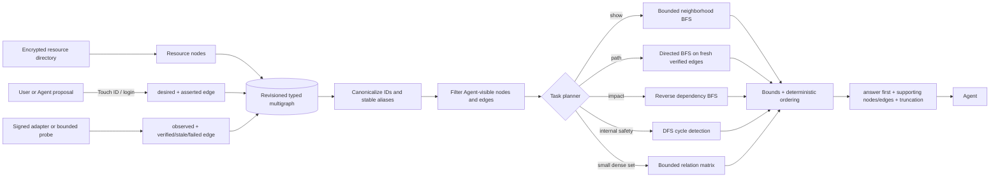
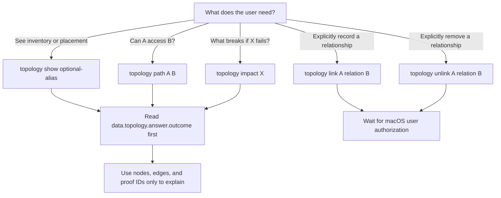

# SAFA Topology: complex inside, simple outside

SAFA stores infrastructure relationships as a directed typed multigraph. The graph is the
authoritative machine representation; Mermaid is only a human explanation of the same rules.

## Internal trust and query pipeline

The important separation is that a proposed link never becomes proof. `desired/asserted` records
what someone intends or believes. Only a signed adapter can create time-bounded observed evidence.
Reachability returns `confirmed` only when the Broker finds a directed path made entirely of fresh,
verified evidence. A stale edge may still be shown for diagnosis but cannot prove the path.

All graph mutations and queries bind to one graph revision. Storage order is ignored. Parallel
edges are preserved because two independent probes can support the same logical relationship.
Limits on hops, nodes, and edges prevent a large graph from flooding an Agent context; if limits
matter, the answer becomes `indeterminate` or the projection sets `truncated: true`.

## The model-facing decision tree

This is intentionally a five-verb interface. The Agent does not choose traversal direction,
algorithm, trust threshold, visibility filter, or bounds. It does not parse a picture to determine
connectivity.

| User intent | One command | Read first |
|---|---|---|
| “这个服务部署/关联在哪里？” | `safa topology show service.api --json` | `data.topology.answer.outcome` |
| “计算节点能访问 MySQL 吗？” | `safa topology path host.compute service.mysql --json` | `confirmed`, `not-found`, or `indeterminate` |
| “NAS 挂了影响什么？” | `safa topology impact storage.reports --json` | `affected_aliases` |
| “记一下 worker 依赖 API” | `safa topology link service.worker depends-on service.api --json` | mutation status |

The table uses fictitious aliases. Real inventory never belongs in this repository.

## Why not one tree or one diagram?

A host may sit in one site, use a route in another security domain, run several services, and depend
on multiple stores. That is not a tree. Visual layout is also ambiguous to models: proximity and
arrow routing can be misread. SAFA therefore keeps the exact graph and proof in JSON, then derives a
small diagram only for human review.
