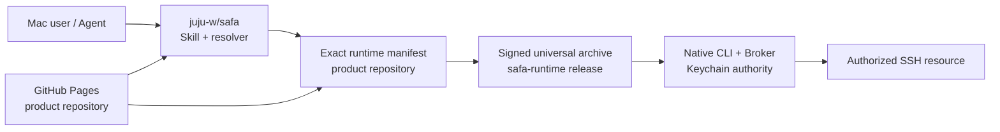
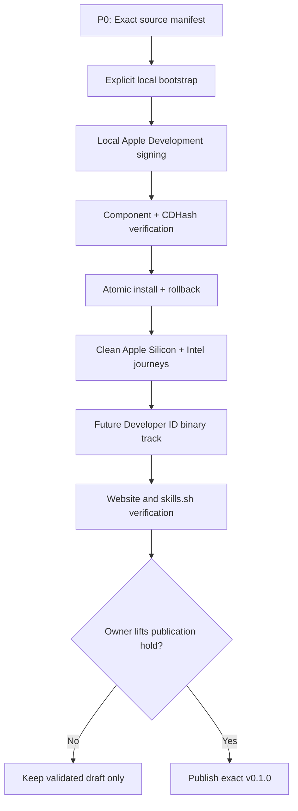

# Implementation Plan: SAFA Public Preview Release

**Branch**: `feat/001-public-preview-release` | **Date**: 2026-08-18

**Spec**: [`spec.md`](spec.md)

## Summary

Deliver the first macOS-only SAFA Source Preview through a copy-only Agent Skill and an exact,
digest-pinned Runtime source archive that is built and Apple Development-signed locally. Developer
ID readiness is deferred to the later prebuilt-binary track. Runtime build/install logic remains in
`juju-w/safa-runtime`; product contracts, source manifest, bootstrap wrapper, Skill, conformance
fixtures, and GitHub Pages content remain in `juju-w/safa`.

No publication occurs while implementing this plan.

## Technical Context

| Concern | Decision |
| --- | --- |
| Public preview | `v0.1.0` Source Preview, explicitly unstable |
| Supported OS | macOS 14.4+ |
| Architectures | Local arm64 or x86_64 build; universal archive deferred |
| Runtime implementation | Swift 6; native Keychain, LocalAuthentication, XPC/Broker boundary |
| Agent contract | `dev.safa.cli/v2`, TOON v2, AXI-reviewed |
| Skill install | `npx skills add juju-w/safa --skill safa -g -a codex` |
| Runtime bootstrap | First `doctor` returns a human-only local build action; exact source manifest |
| Preview trust | SHA-256-pinned source + local Apple Development signing + component/CDHash lock |
| Future binary trust | Developer ID Application + Hardened Runtime + timestamp + notarization |
| Website | Static GitHub Pages experience layer; canonical facts generated or checked from repo data |

## Repository Ownership

### `juju-w/safa` owns

- public Spec and release checklist;
- Agent Skill and shell resolver;
- CLI/resource/topology/runtime-manifest contracts;
- exact verified Runtime manifest;
- clean-profile and cross-repository conformance tests;
- website source and public product claims.

### `juju-w/safa-runtime` owns

- Swift sources, native CLI, Broker, helpers, Keychain and authorization adapters;
- universal build and nested signing order;
- entitlements, Developer ID signing, notarization, stapling, checksums, and draft release assets;
- Runtime unit, integration, security, packaging, and rollback evidence.

## Gate Sequence

Source Preview closes the functional workflow before incurring Apple Developer Program cost. The
future Developer ID smoke artifact still precedes binary release automation, but it is not a blocker
for local source builds.

## Source Preview Bootstrap

1. The launcher detects that no verified Runtime lock exists and returns one `safe_for_agent: false`
   command. It does not download or compile during ordinary Agent invocation.
2. The local human runs the dedicated source-preview installer from the Skill directory.
3. The installer validates the checked-in manifest and local toolchain, detects exactly one usable
   Apple Development team or accepts an explicit team selection, downloads the exact archive, and
   verifies SHA-256 before extraction.
4. It validates the archive root/path layout, invokes the pinned Runtime installer, and lets that
   installer build, sign, verify, stage, atomically activate, and write the local CDHash lock.
5. The user reruns `doctor`; all later Agent calls pass through the normal verified launcher.

## Apple Credential Strategy

### Future local Developer ID proof

Use a `Developer ID Application` identity whose private key is stored in the login Keychain. Store
notarization credentials under a named `notarytool` Keychain profile. The user enters Apple secrets
directly into Apple's tools; scripts receive only the profile name and signing identity selector.

### Future binary CI after the publication hold

Import the Developer ID certificate from encrypted GitHub environment secrets into an ephemeral
build keychain. Prefer a team App Store Connect API key for `notarytool`; individual API keys cannot
use `notarytool`. Scope the release environment to protected branches and required reviewers, never
print identifiers unnecessarily, destroy the temporary keychain, and keep public workflows
validation-only until release approval.

## Runtime Packaging Design

1. Build Release binaries for arm64 and x86_64 with the declared deployment target.
2. Combine matching products with `lipo`; reject missing or unexpected slices.
3. Stage the app/runtime bundle in a fresh private directory.
4. Sign nested helpers, XPC services, frameworks, executables, and outer bundle from inside out.
5. Apply Hardened Runtime and secure timestamps with reviewed component-specific entitlements.
6. Verify every component using `codesign`, inspect architectures and entitlements, and reject
   `get-task-allow` in distribution output.
7. Create a notarization-supported archive, submit with `notarytool`, wait for acceptance, archive the
   non-secret log, staple and validate the ticket, then rebuild the final immutable archive if needed.
8. Generate SHA-256, component identifiers/CDHashes, minimum OS, CLI schema, and manifest candidate.
9. Run clean-profile install, bootstrap, health, synthetic exec, upgrade, failure, and rollback tests.

## Manifest and Bootstrap Work

The current public manifest contract already pins platform, architecture, version, HTTPS URL,
digest, archive format, minimum OS, and Apple team/bundle identity. Before publication it must also
represent the complete native component identity set and expected entry point. The resolver must
verify these fields and native policy before atomic activation.

The universal archive may be selected by either architecture-specific manifest entry, with identical
asset URL and digest, as long as the archive and every required executable are independently proven
universal. A later manifest revision may represent `universal2` directly, but release work must not
silently change the v1 contract.

## Website Delivery

The website is a later release gate, not a prerequisite for Developer ID work. It lives under
`website/` in the product repository and deploys statically to GitHub Pages. Initial pages:

- Home: one concrete Agent incident-diagnosis conversation and install action;
- Demo: an interactive but synthetic Skill → resolver → Runtime → Broker journey;
- Security: threat boundary, native authorization, supply-chain verification, limitations;
- Docs: installation, first resource, topology, bounded exec, troubleshooting;
- Releases: exact version, checksums, provenance, supported platforms.

Version, install command, platform status, and release provenance are generated from or checked
against canonical manifests and documentation in CI. Existing mascot assets may be reused, but
responsive HTML owns text and primary calls to action.

## Testing Strategy

- Product repository: Markdown and schema consistency, runtime-manifest fixtures, resolver contract,
  TOON conformance, clean-profile journey, Skill validation, secret scanning, link/content drift.
- Runtime repository: formatting, Debug/Release builds, unit/integration/security tests, universal
  architecture checks, entitlements, signatures, notarization, Gatekeeper, credential leak checks.
- Cross-repository release candidate: exact manifest against exact archive, clean Apple Silicon and
  Intel profiles, first install, repeat `doctor`, failed update, rollback, and bounded synthetic SSH.
- Website: static build, accessibility smoke test, responsive screenshots, broken links, and
  canonical claim drift.

## Rollout and Rollback

1. Produce a non-public notarized smoke artifact.
2. Build a draft `v0.1.0` candidate and exact manifest on short-lived branches.
3. Validate clean profiles without listing the release publicly.
4. Obtain explicit owner approval to lift the hold.
5. Publish the exact Runtime release first; verify assets and immutable digests.
6. Merge the matching product manifest/Skill revision and verify skills.sh discovery.
7. If bootstrap health fails, stop promotion and keep the previous verified Runtime selected. Never
   overwrite the exact tag or asset; fix forward with a new exact patch version.
