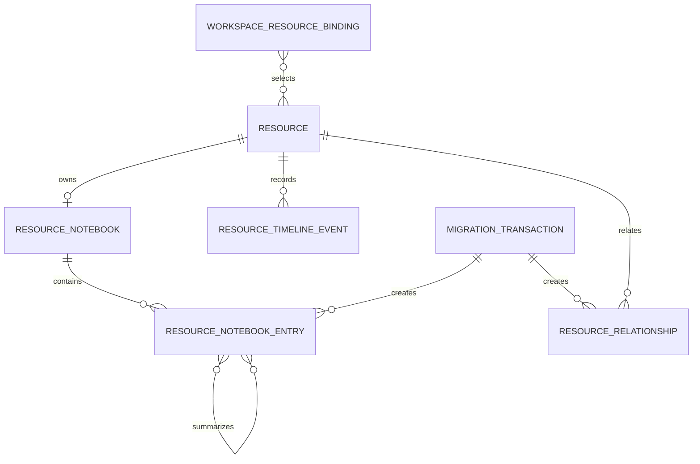

# Data Model: Resource Cards and Operational Memory

**Status**: Proposed post-RC model; not current behavior or a core-RC implementation plan

**Date**: 2026-08-23

This model is platform-neutral. Swift type names describe the current macOS implementation target;
other runtimes may use different storage and IPC while preserving the same entities, authority, and
validation behavior.

## Relationship overview



`ResourceCardProjection` and `TrustedResourceViewV1` are derived projections and are never persisted
as authority.

## Existing entity: Resource and ResourceProfile

The Runtime already stores `Resource` in `VaultDocument` and `ResourceProfile` inside each Resource.
This feature does not create a second Profile entity.

Relevant existing fields:

| Field | Type | Rule |
|---|---|---|
| `Resource.id` | UUID | Immutable identity for every memory association |
| `alias` | validated logical alias | Mutable only through existing authorized lifecycle; never a persistence join key |
| `displayName` | optional authorized text | Not Agent-visible by default; does not automatically become `cardName` |
| `profile.classification` | typed classification | Runtime fact |
| `profile.roles` | typed identifiers | Runtime fact; safe allowlisted projection only |
| `profile.relationships` | typed relations by Resource ID | Canonical desired relation, separately projected by safe alias |
| `verification` | typed adapter verification | Runtime fact; current evidence takes precedence over Notebook text |
| `revision` | UInt64 | Current Resource fact revision used in Timeline and conflict display |
| `state` | draft/active/disabled/deleted | Existing lifecycle remains authoritative |

The product Profile layer is the composition of this aggregate, current bounded probes, and the
existing `SafeResourceProjection`.

## New entity: ResourceNotebook

One encrypted semantic container bound to a non-deleted Resource ID.

| Field | Type | Validation |
|---|---|---|
| `resourceID` | UUID | Required; unique across active notebooks; must resolve to a Resource |
| `revision` | UInt64 | Starts at 1; increments once per committed Notebook mutation |
| `entries` | ordered NotebookEntry IDs or embedded values | Maximum counts and encoded-size policy apply |
| `createdAt` | timestamp | Broker clock |
| `updatedAt` | timestamp | Broker clock; monotonically non-decreasing |

### ResourceNotebookEntry

| Field | Type | Validation |
|---|---|---|
| `id` | UUID | Opaque, immutable |
| `sourceClass` | `user_guidance`, `agent_observation`, `agent_summary` | Determined by authenticated IPC role, never upgraded from request text |
| `kind` | `card_name`, `purpose`, `caution`, `guidance`, `observation`, `summary` | Allowed combinations below |
| `body` | normalized UTF-8 text | Safe-text policy; source-specific byte limit |
| `state` | `active`, `superseded`, `removed`, `expired` | State transition rules below |
| `pinned` | Bool | True by default for user guidance; Agent callers cannot set or clear it |
| `createdAt` | timestamp | Broker clock |
| `expiresAt` | optional timestamp | No automatic expiry for pinned user guidance; default 90 days for Agent observations |
| `originCaller` | authenticated caller classification | Broker-derived; optional self-declared label stored separately |
| `requestReference` | optional opaque request/evidence ID | Must belong to the same Resource when supplied |
| `idempotencyDigest` | optional fixed digest | Derived from caller, Resource ID, nonce, and normalized body |
| `sourceEntryIDs` | ordered UUID list | Required only for summaries; 1 to 32 active/superseded observations |
| `migrationTransactionID` | optional UUID | Set only by a committed migration transaction |
| `supersededBy` | optional entry UUID | Must reference a summary in the same Notebook |
| `removedAt` | optional timestamp | Required for removed/expired state |

Allowed source/kind combinations:

| Source | Kinds |
|---|---|
| `user_guidance` | `card_name`, `purpose`, `caution`, `guidance` |
| `agent_observation` | `observation` |
| `agent_summary` | `summary` |

Limits:

- at most 16 active user-guidance entries, each at most 1,024 UTF-8 bytes, including zero or one
  active `card_name` entry;
- at most 64 active Agent observations, each at most 512 UTF-8 bytes;
- at most 8 active Agent summaries, each at most 2,048 UTF-8 bytes;
- at most 128 KiB encoded Notebook state per Resource;
- one observation per terminal request and 20 observations per Resource per hour;
- summary sources are unique, deterministic, and all belong to the same Resource Notebook.

State transitions:

```text
active -> superseded   Agent summary committed for exact source set
active -> removed      trusted-local user action or migration rollback
active -> expired      deterministic retention for eligible Agent content
superseded -> removed  trusted-local removal or retention after recovery interval
expired -> removed     deterministic retention
```

No transition returns an entry to active. A correction creates a new immutable entry and supersedes
or removes the old one. Pinned guidance cannot transition automatically.

## New entity: ResourceTimelineEvent

A Runtime-authored immutable mechanical event. It is not an AuditEvent and contains no free-form
Agent or remote text.

| Field | Type | Validation |
|---|---|---|
| `id` | UUID | Opaque, immutable |
| `resourceID` | UUID | Required; binds by Resource ID, not alias |
| `taskClass` | allowlisted identifier | Derived from Broker use case/policy, never supplied as free text by Agent |
| `terminalState` | `completed`, `failed`, `denied`, `cancelled`, `expired`, `no_op` | Terminal only |
| `timestamp` | timestamp | Broker clock |
| `resourceRevision` | UInt64 | Resource fact revision observed at terminal recording |
| `evidenceReference` | optional opaque identifier | Never raw fingerprint, command, or output |
| `migrationTransactionID` | optional UUID | Used only for migration lifecycle events |

Uniqueness is `(resourceID, evidenceReference, taskClass)` when an evidence reference exists;
otherwise event ID is unique. Events are ordered by timestamp then ID. Each Resource retains at most
128 events and 64 KiB within the 90-day retention window.

Accepted operations are execution requests plus state-changing Resource, Notebook, workspace
binding, and migration operations. Safe card/list/history reads do not append events.

## Derived entity: ResourceCardProjection

A bounded Agent-safe projection composed at read time. It cannot be used as an execution or
credential selector.

| Field | Source | Default rule |
|---|---|---|
| `alias` | Resource fact | Always present |
| `cardName` | active trusted `user_guidance/card_name` entry | Optional; never copied automatically from authorized `displayName` |
| `role` | typed safe role plus confirmed purpose | One bounded summary |
| `state` / `health` | current Runtime facts | Always authoritative |
| `capabilities` | current effective capability projection | At most 8 identifiers in detail |
| `summary` | newest active Agent summary or confirmed purpose | At most 500 characters; source identified |
| `guidance` | pinned user guidance | At most 3 previews of 240 characters |
| `recentChanges` | Timeline | At most 3 safe mechanical events |
| `relationships` | Resource relationships | At most 6 safe logical alias relations |
| `conflicts` | composer | Bounded source-conflict signals; no raw protected values |
| `counts` | composer | Exact totals/returned/truncated for bounded collections |

Composition order is deterministic:

1. load current Runtime facts;
2. load active pinned guidance;
3. load active summary and unsuperseded observations;
4. load retained Timeline events;
5. resolve relationships to current safe aliases;
6. detect conflicts without flattening sources;
7. apply item, text, encoded-byte, and TOON projection budgets.

The workspace list projection returns at most eight rows with exactly four requested fields and a
2 KiB hard TOON limit. Detailed `resource show` returns at most 6 KiB.

## New entity: AgentObservationProposalV1

Agent-facing immutable request DTO for optional durable memory.

| Field | Type | Validation |
|---|---|---|
| `resourceAlias` | safe alias | Resolved to current Resource ID inside Broker |
| `body` | text | Required, normalized, maximum 512 UTF-8 bytes |
| `clientNonce` | bounded opaque string | Required for idempotency; maximum 128 bytes |
| `requestReference` | optional opaque ID | Must resolve to same Resource and a terminal request |
| `selfDeclaredAgentLabel` | optional text | Non-authoritative, bounded, and filtered |

The Broker derives source class and caller identity. An identical retry is a successful no-op; nonce
reuse with different normalized content is a conflict. The response never echoes the body.

### AgentSummaryProposalV1

P2 uses the same public observation mutation with an opaque `summaryTicket` in place of a request
reference. The authenticated ticket binds one Resource ID, 1 to 32 exact source entry IDs, expected
Notebook revision, and a short expiry. The proposal carries only the ticket, a body of at most 2,048
UTF-8 bytes, and an idempotency nonce. Broker validates and consumes the ticket atomically, appends
the summary, and marks the bound sources superseded. Neither source IDs nor Notebook revision appear
in the default card or Agent request.

## New entity: WorkspaceResourceBinding

An encrypted mapping used only for ambient relevance.

| Field | Type | Validation |
|---|---|---|
| `id` | UUID | Opaque |
| `workspaceScopeDigest` | keyed digest | Broker-derived from normalized local path; plaintext path is not persisted in vault |
| `includeDescendants` | Bool | Fixed by trusted-local setup; default true |
| `resourceIDs` | ordered unique UUID list | Every ID must resolve to a non-deleted Resource at commit |
| `agentTargets` | validated identifiers | Only adapters whose conformance has passed may be activated |
| `state` | `active`, `disabled` | Trusted-local transition only |
| `configurationDigest` | digest | Binds the expected namespaced hook fragment for safe repair/removal |
| `createdAt` / `updatedAt` | timestamps | Broker clock |

The runtime receives the current directory from the fixed integration call, computes the same keyed
digest, and returns only active matching Resource IDs. A deleted Resource is removed from bindings in
the same Resource-removal transaction.

## Derived entity: TrustedResourceViewV1

Platform-neutral trusted-local snapshot:

- **Overview**: Resource facts and safe card; Profile facts are read-only.
- **Activity**: bounded/paged Timeline events; events are read-only.
- **Guidance**: source-labelled Notebook entries with age, state, conflict, and trusted mutation
  actions.
- **Access**: credential and authorization status plus protected action identifiers; no value,
  locator, fingerprint, or endpoint is included in the common product DTO.

Guidance mutations include expected Notebook revision and are authorized from the trusted-local IPC
peer. Access actions continue through platform-native authentication.

## New entities: SSH-hosts migration

### MigrationCandidateV1

| Field | Type | Rule |
|---|---|---|
| `id` | UUID | Transient opaque ID |
| `sourceLocation` | section/row/column coordinates | Trusted-local only; never Agent output |
| `classification` | fixed migration class | Deterministic classifier result |
| `normalizedValue` | optional text | Present only for safe semantic/ambiguous candidates; never for protected or secret-like data |
| `destination` | optional typed destination | Notebook field, Resource binding, or relation candidate |
| `selected` | Bool | Defaults false for ambiguous or stale claims |
| `reasonCode` | stable identifier | No protected content in message |

### SSHHostsMigrationPlanV1

| Field | Type | Rule |
|---|---|---|
| `sourceDigest` | digest | Recomputed at commit |
| `adapterVersion` | version identifier | Exact parser/classifier version |
| `candidates` | bounded transient list | Trusted-local only |
| `resourceBindings` | candidate to Resource ID mapping | Only verified Resources allowed to become ready |
| `counts` | per-class totals | Safe summary may be shown without values |
| `planDigest` | digest | Covers source digest, adapter version, selections, and bindings |
| `state` | migration state | State machine below |

### MigrationTransaction

Persisted only after confirmation/commit. It contains transaction ID, source digest, adapter
version, plan digest, committed entry/relation IDs, prior states required for rollback, actor, and
timestamps. It contains no source text or protected values.

State transitions:

```text
selected -> classified -> previewed
previewed -> bindings_required -> ready
previewed -> ready
ready -> user_confirmed -> pending_verification -> committed
selected|classified|previewed|bindings_required|ready|user_confirmed|pending_verification
  -> cancelled|failed
committed -> rolled_back
```

Commit is one revision-checked vault transaction. A changed source or plan digest, missing Resource,
unverified Resource, relation to a missing target, or secret-like selected value fails before write.
Rollback changes only IDs and prior states recorded by that transaction.

## VaultDocument additions

The Runtime adds backwards-compatible top-level collections with explicit decoding defaults:

```text
resourceNotebooks: [ResourceNotebook] = []
resourceTimelineEvents: [ResourceTimelineEvent] = []
workspaceResourceBindings: [WorkspaceResourceBinding] = []
migrationTransactions: [MigrationTransaction] = []
```

Resource removal deletes the Resource Notebook, all Timeline events, workspace-binding references,
and pending migration bindings for that Resource in the same vault mutation. No deleted alias may
resolve old semantic content.
